# React Native Workshop

## S01E01 "Getting Started"

First of all you need to install [Android Studio](https://developer.android.com/studio/index.html). We will not use it often, but for some tasks it makes things much easier.

### Install Android Emulator

1. In Android Studio open `AVD Manager`:

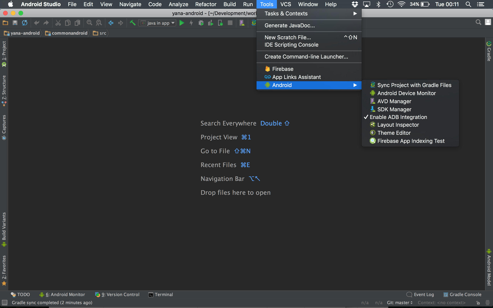

You should see following screen (except if you do it for the first time ever your list if most likely empty):

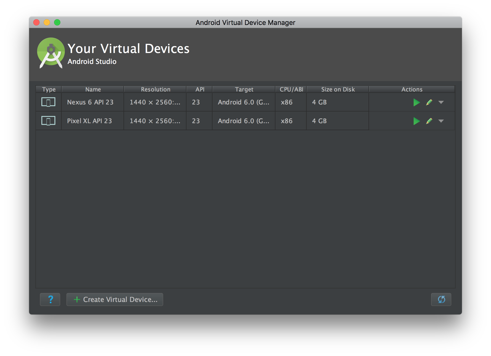

2. Click `Create Virtual Device...`, pick device definition of your choice:

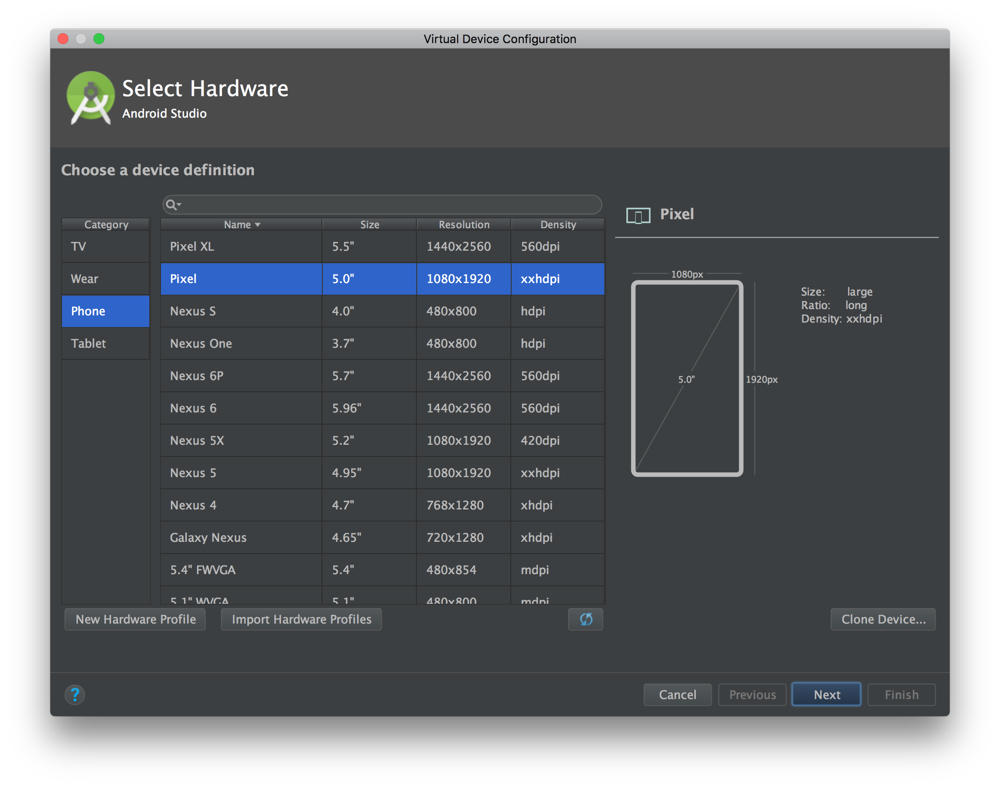

3. Choose the system image - for React Native as far as I am aware it just has to be greated than API Level 16:

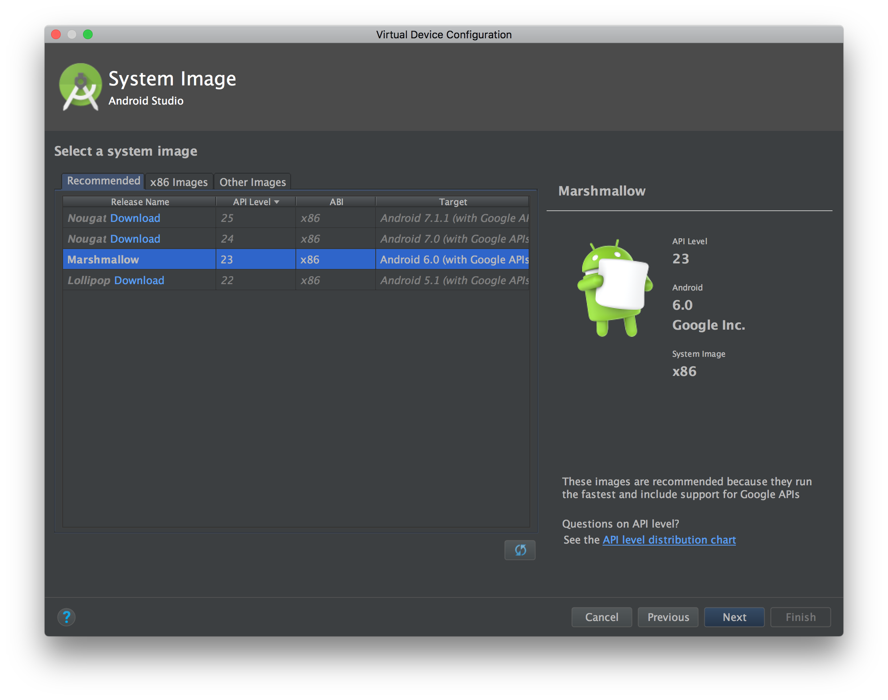

4. Submit the changes:

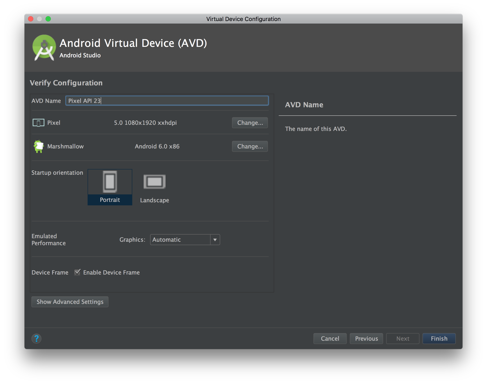

5. At this stage we do not need anymore **Android Studio** and we will execute all commands from the command line (webdev way ftw! ;)) so feel free to close it.

## Install React Native

There are quite a few things needed to install and run React Native. React is a Javascript framework, so you will need **NodeJS**. The easiest way to install **NodeJS** is to use **Homebrew** package manager.

Check if **Homebrew** is installed:

```
$ brew --version
Homebrew 1.1.12
Homebrew/homebrew-core (git revision fdcb7; last commit 2017-04-12)
```

If you get anything like:

```
command not found
```

Go to [Homebrew website](https://brew.sh/) and follow installation instructions.

1. Install NodeJS and Watchman:

```
$ brew install node
$ brew install watchman
```

2. Install **React Native CLI**

```
$ npm install -g react-native-cli
```

If I missed anything look into [official React Native documentation](https://facebook.github.io/react-native/docs/getting-started.html) for advices.

## Running Android device emulator:

1. If you have **Docker** or **Virtual Box** running on your machine, quit it.

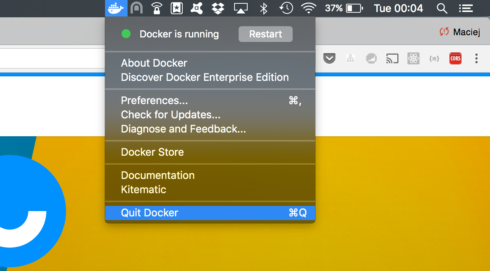

Otherwise you may get nasty error like:

```
emulator: ERROR: Unfortunately, there's an incompatibility between HAXM hypervisor and VirtualBox 4.3.30+ which doesn't allow multiple hypervisors to co-exist.  It is being actively worked on; you can find out more about the issue at http://b.android.com/197915 (Android) and https://www.virtualbox.org/ticket/14294 (VirtualBox)
```

2. List all emulators installed on your machine

```
$ emulator -list-avds
Nexus_6_API_23
Pixel_XL_API_23
```

3. Run emulator of your choice by calling same command with emulator name prefixed with `@` character as a parameter:

```
$ emulator @Pixel_XL_API_23
```

4. After short while (like 2 mins) you should see following screen:

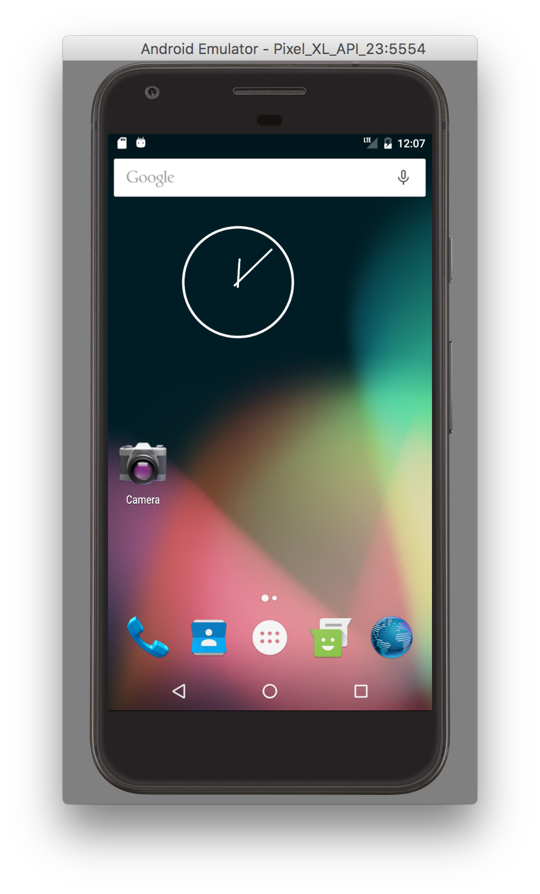

You can minimize it, keep it somewhere on the side, but do not close it.

## Create new React Native project

In order to create new RN project execute following command in your terminal in a directory where folder with new project will be created:

```
$ react-native init workshop1
```

This should take some seconds (or minutes).

## Run sample application

```
$ cd workshop1
$ react-native run-android
```

First run takes a while as it executes **Gradle** build in one terminal window and builds React project in another.

When it is ready, in your terminal windows you should see something similar to:
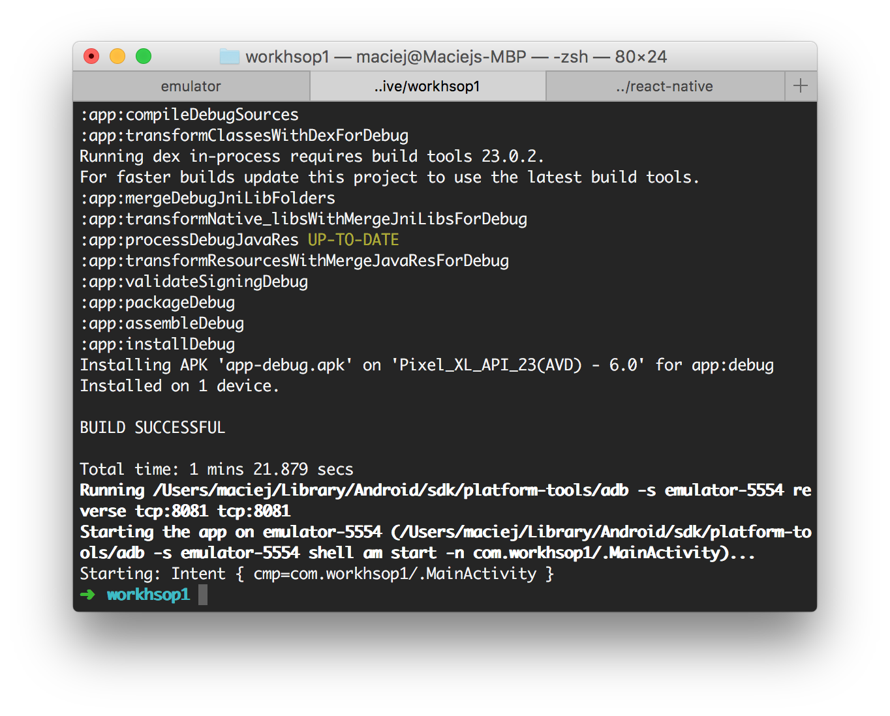
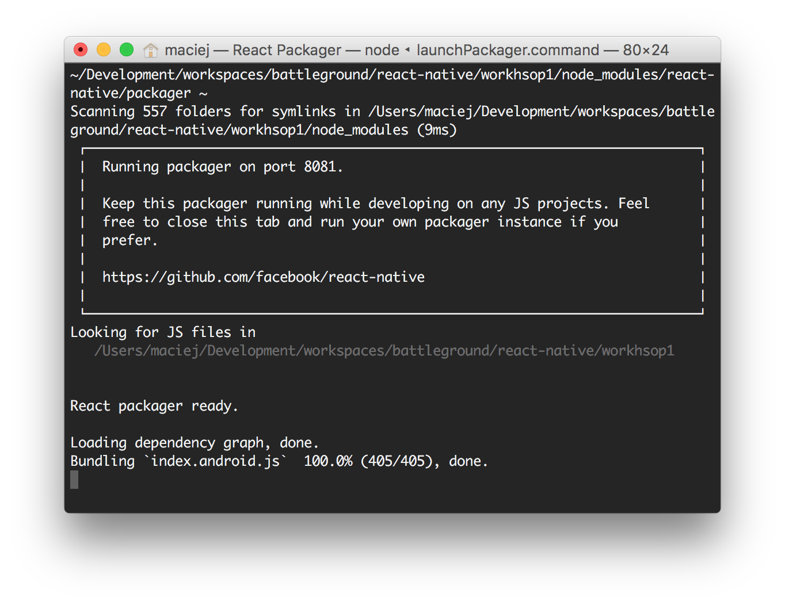
When you switch back to running emulator, you should see your first running React Native application:
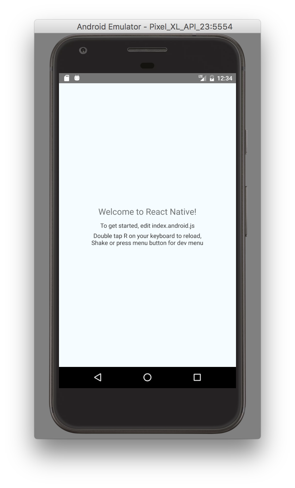
Congrats!

## Editor

You can use any code editor you like. Since writing RN code is mainly coding JavaScript I recommend something with good JavaScript support:

- Intellij IDEA Ultimate
- WebStorm
- Visual Studio Code 

I recently gave a try to **Visual Studio Code** and so far I am loving it!

If you decide to go with **Visual Studio Code**, install following extensions:

- [React-Native/React/Redux snippets for es6/es7](https://marketplace.visualstudio.com/items?itemName=EQuimper.react-native-react-redux)

To open generated project in **VS Code** just drag & drop it to an icon on the dock. You should see something similar to:

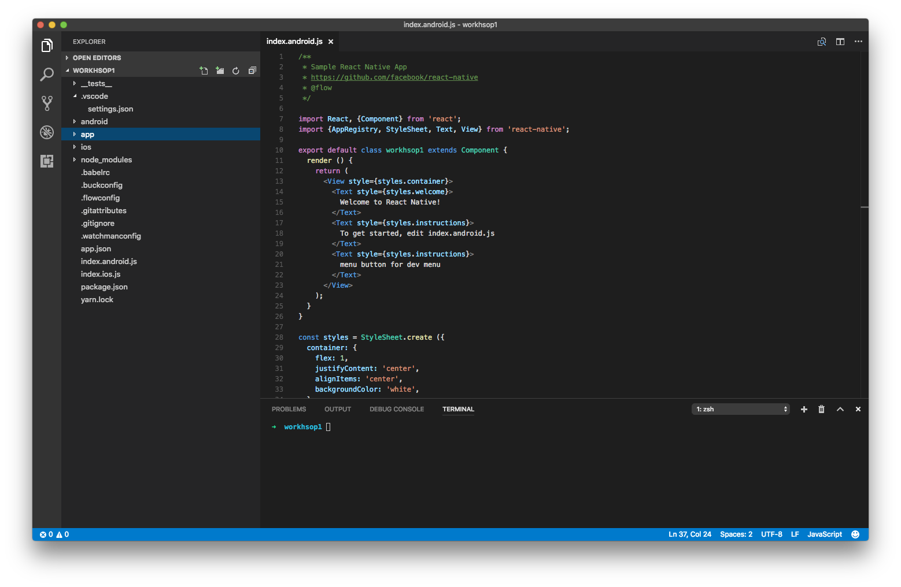